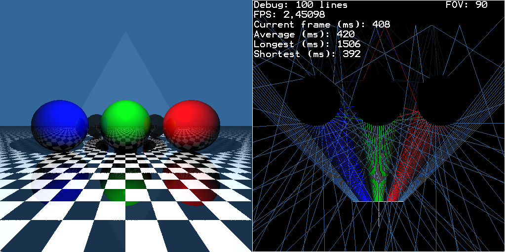
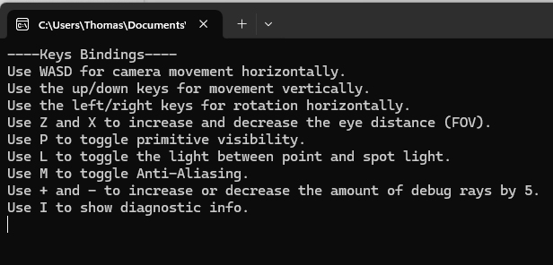

# Graphics Assignment - Raytracer

**Made by:** _Kevin, Lennert, Thomas_

**Course Teacher:** _Jacco Bikker_

    SUMMARY

- BASIS: Done.
- TRIANGLES: Done.
- QUADS: Done.
- SPOTLIGHT: Done.
- SKYDOME: Done, but differently.
- INTERACTION: Done and extended.
- MIRRORS: Done, no reflection.
- SHADERS: Attempted.
- ANTI-ALIASING: Done.
- TEXTURES: Not done.

---

    QUICK NOTES

- Our coordinate system is a different one than usual. Z is up, Y is forward, X is right.
- We've kept focus on clean code, rather than fast code.

---

    DESCRIPTION

When starting the application, two windows will pop-up. The first is an overview of all actions (see: Extended interaction). The second window is the actual raytracer itself which consists of two parts:

- On the left: The raytracer view of the defined scene graph
- On the right: The debug view that show a set of rays (which can be decremented and incremented)

Out of the box, the scene contains three spheres, a triangular mirror, a checkerbox floor and a skybox. In the Scenegraph.cs optional elements / components can be toggled on / off.

---

    BONUS ACTIVITIES

In the section below is a small description per bonus activity.
Some of the activities were given as an additional challenge for points, but we've also experimented a bit with other extras that were not listed as bonus.
We hope some of these 'unlisted bonus assignments' still count towards style or

---

    TRIANGLE SUPPPORT

Triangles are fully supported in the raytracer.
They have been implemented using the suggested M ller-Trumbone triangle intersection method.
The triangles are assumed to be one-sided and thus only appear when viewed from the front.
If the side is viewed from the front or from the back is decided by the normal of a triangle, which in turn can be defined by describing the triangle as:

Clockwise: A - B - C

or

Counter-Clockwise: A - C - B

The normal is only calculated on creation of the triangle, making it a static object.
The option for dynamic triangles is supported by using the GetNormal function which is designed to be an abstract method of the Primitive class.
This function calculates the normal by taking the Crossproduct of (B - A) and (C - A).

---

    QUAD SUPPPORT

Quads are fully supported in the raytracer.
They have been implemented using the same implementation as the triangle, since a quad consists of two triangles.
The same goes for the normal implementation.

Clockwise: A - B - C - D

or

Counter-Clockwise: A - D - C - B

---

    SPOTLIGHT

Spotlight uses the normal Light class (which can be described as a pointlight) and uses an extra direction vector and an angle.
The angle defines wether shadow rays hit the light by comparing the angle of the ray with the angle.

---

    SKYDOME

A skydome has been implemented.
While working on implementing a skydome by using the method described by Paul Debevec we ran in to a few problems.
The greatest problem being our coordinate system.
Our coordinate system uses a Z axis as an up vector, X axis as right a right vector and Y as a forward vector.
This coordinate system did not matchup with the instructions given by Paul Debevec, so we had to try something else.
The upper halve of the skydome is reflected in all directions to create the same effect.

---

    EXTENDED INTERACTION

The user is able to do quite a few things in runtime.
These 'things', or actions rather, have a keybinding set to them which are summarized in the console window that appears in the background.

A key binding window will pop up on start up.

- Use WASD for camera movement horizontally.
- Use the up/down keys for movement vertically.
- Use the left/right keys for rotation horizontally.
- Use Z and X to increase and decrease the eye distance (FOV).
- Use P to toggle primitive visibility.
- Use L to toggle the light between point and spot light.
- Use M to toggle Anti-Aliasing.
- Use + and - to increase or decrease the amount of debug rays by 5.
- Use I to show diagnostic info.

---

    MIRRORS

The triangle in the background is a mirror.
We've added a material called mirror to show (almost) full reflection.
The mirror has a slightly gray color (0.05f, 0.05f, 0.05f) to visualise the edge.
Full reflection would require a color of (0, 0, 0), or rather black.
Light, however, does not get reflected through the mirror, that was one of the goals we had yet to achieve.

---

    ATTEMPTED SHADERS

We made an attempt to use shaders for anti-aliasing in a post-process fase.
The setup can still be found in the source code, the call to the AntiAlias class has been removed however.
All the code has been left in the files to show how far we've made it.
This a goal that we set as an bonus if we had the time, but we choose to focus on other points, mainly fixing bugs.

---

    ANTI-ALIASING

Anti-Aliasing is fully implemented.
The method we use is a post-processing function and it takes each pixel and takes an average of its color an it's neighbors.
Anti aliasing is by default off to safe a little bit of the precious framerate.
Use M to activate the anti-aliasing.

---

    TEXTURES

We wanted to do textures but we didn't get around to it.
There is however a small left-over of a setup we made to easily implement it further down the line, but alas the line never got that far.
This left-over is the GetTexture and SetTexture function in every primitive.
The idea was to use the surface class given in Assigment 1 which we reused for this assignment with the slightests of adjustments.

---

    SOURCES

Some sources we've found to be very helpful during this project are listed below. We never tried to copy anything from them.

https://learnopengl.com/#!Lighting/Basic-Lighting
http://lodev.org/cgtutor/raycasting.html
http://geomalgorithms.com/a06-_intersect-2.html
